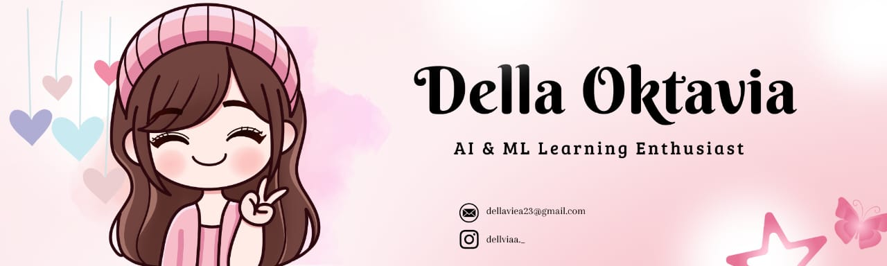

## Hi! i'm Della👋

<!--
**Dellviea/dellviea** is a ✨ _special_ ✨ repository because its `README.md` (this file) appears on your GitHub profile. />

Here are some ideas to get you started:

- 🔭 I’m currently working on ...
- 🌱 I’m currently learning ...
- 👯 I’m looking to collaborate on ...
- 🤔 I’m looking for help with ...
- 💬 Ask me about ...
- 📫 How to reach me: ...
- 😄 Pronouns: ...
- ⚡ Fun fact: ...
-->

<!-- #### 🌸 About Me
I'm Della Oktavia, a curious learner with an interest in Artificial Intelligence & Machine Learning and Backend Development, who enjoys exploring new technologies and learning new things along the way. -->

#### Skills
<!-- 
kalo mau ditengah 
  

 -->

<!--  -->

#### 🌐 Socials:
  

#### 📊 GitHub Stats

  

#### 🎮 Play game with me
<picture>
  <source media="(prefers-color-scheme: dark)" srcset="https://raw.githubusercontent.com/Dellviea/Dellviea/output/pacman-contribution-graph-dark.svg">
  <source media="(prefers-color-scheme: light)" srcset="https://raw.githubusercontent.com/Dellviea/Dellviea/output/pacman-contribution-graph.svg">
  
</picture>

 

  

